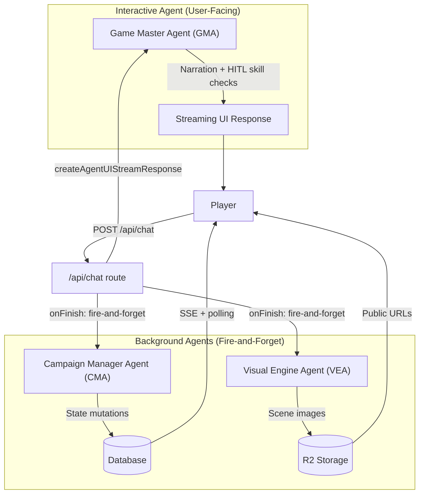

# Agentic Architecture

**Canonical Reference for RPGen's AI Agent Patterns, Data Contracts, and Execution Models**

This document serves as the **centralized repository** for documenting RPGen's AI flows, technology stack, and patterns. All agent implementations, tool definitions, and message handling should align with the principles and patterns described here.

---

## Table of Contents

1. [Scope & Non-Goals](#scope--non-goals)
2. [System Architecture](#system-architecture)
3. [Data Contracts](#data-contracts)
4. [Execution Patterns](#execution-patterns)
5. [Operational Best Practices](#operational-best-practices)
6. [Migration & Refactoring](#migration--refactoring)

---

## Scope & Non-Goals

### What This Document Covers

- **Agentic patterns** using AI SDK v6 `ToolLoopAgent` for interactive narration and background state management
- **Human-in-the-Loop (HITL)** tool patterns for player skill checks
- **Background agent** patterns for deterministic state reconciliation and asset generation
- **Data contracts** for messages, tool parts, and persistence invariants
- **Execution models** for streaming interactive responses vs. non-blocking background processing

### What This Document Does NOT Cover

- **Universe/Character/Campaign generation** (see `docs/features/implemented/` for feature-specific docs)
- **Database schema design** (see `src/lib/db/schemas/` and `docs/ARCHITECTURE.md`)
- **Client-side UI components** (see `src/components/` and component-specific docs)
- **Authentication & authorization** (handled by Clerk; see `src/lib/auth/`)

### Terminology

- **Agent**: An AI SDK v6 `ToolLoopAgent` instance that encapsulates model configuration, tools, and loop control. Agents can be interactive (streaming UI responses) or background (non-blocking state mutations).
- **Workflow**: A predefined sequence of agent calls or tool invocations. RPGen uses workflows sparingly; most logic is agent-driven.
- **HITL Tool**: A tool that requires human input before execution. The tool part transitions from `state: "input-available"` to `state: "output-available"` after user action.
- **Background Agent**: An agent that runs asynchronously (fire-and-forget) without blocking the main request. Used for state reconciliation and asset generation.

---

## System Architecture

RPGen uses a **three-agent architecture** that cleanly separates interactive narration from background state management and visual generation.

### Agent Responsibilities



### Game Master Agent (GMA)

**Location**: `src/agents/game-master.ts`

**Responsibilities**:

- **Narration**: Generate immersive, descriptive storytelling that responds to player actions
- **HITL Skill Checks**: Issue `requestSkillCheck` tool calls that pause the narrative until the player rolls dice
- **Read-only Context**: Access campaign state, quests, and universe information for narrative awareness only

**Key Constraints**:

- **NO state mutations**: GMA cannot modify campaign state (quests, fronts, vectors, relationships)
- **Single tool**: Only `requestSkillCheck` (HITL tool) is available
- **Streaming output**: Uses `createAgentUIStreamResponse` to stream tokens to the UI in real-time
- **Bounded loops**: `stopWhen: stepCountIs(5)` to prevent tool spam

**Model**: OpenRouter `base` category (fast, cost-effective for narration)

**Example System Prompt Excerpt**:

```
You are the Game Master Agent (GMA) for a text-based RPG campaign.
- You are a storyteller and narrator. Your ONLY job is to narrate the game world and handle player interactions.
- You CANNOT modify campaign state (quests, fronts, vectors, relationships). That is handled by the Campaign Manager Agent (CMA) in the background.
- When a player action requires a skill check, use the requestSkillCheck tool with the appropriate attribute and difficulty.
```

### Campaign Manager Agent (CMA)

**Location**: `src/agents/campaign-manager.ts`

**Responsibilities**:

- **State Reconciliation**: Analyze recent transcript and update campaign state deterministically
- **Quest Management**: Create quests, update quest status/logs/clues based on player actions
- **Front Advancement**: Advance plot threats (Fronts) when ignored or conditions progress
- **Narrative Vectors**: Update Hope/Chaos levels based on campaign momentum
- **Knowledge Graph**: Manage relationships between NPCs, factions, and locations

**Key Constraints**:

- **Sole state writer**: CMA is the ONLY agent that modifies campaign state (GMA and VEA are read-only)
- **No HITL tools**: CMA excludes `requestSkillCheck`; all tools execute server-side
- **No user-facing output**: CMA produces no narration or chat text
- **Bounded loops**: `stopWhen: stepCountIs(3)` for efficient background processing
- **State comparison**: Captures original state copy and exposes `hasStateChanged()` for persistence decisions

**Model**: OpenRouter `reasoning` category (better for deterministic state logic)

**Tools**:

- `updateNarrativeVector`: Adjust Hope/Chaos levels
- `manageRelationship`: Update Knowledge Graph edges
- `advanceFront`: Move Front doom clocks forward
- `createQuest`: Create new quest threads
- `updateQuest`: Update quest status, logs, or clues

**Example System Prompt Excerpt**:

```
You are the Campaign Manager Agent (CMA) - the SOLE state management system for this campaign.
- You are NOT an interactive Game Master. Do NOT produce narration or chat text.
- You are the SOLE state manager - GMA does NOT modify state, only you do.
- Analyze the recent transcript for state changes that need reconciliation.
- Use deterministic logic to update campaign state based on established patterns.
```

### Visual Engine Agent (VEA)

**Location**: `src/agents/visual-engine.ts`

**Responsibilities**:

- **Scene Generation Decision**: Determine when narrative changes warrant a new scene image
- **Prompt Crafting**: Generate detailed image prompts with character/universe context
- **Image Generation**: Trigger Replicate API to generate scene images and store them in R2

**Key Constraints**:

- **No user-facing output**: VEA produces no narration or chat text
- **Narrative text gate**: Only runs when `hasNarrativeText()` is true (skips tool-call-only messages)
- **Bounded loops**: `stopWhen: stepCountIs(3)` for efficient background processing
- **SSE notifications**: Broadcasts `scene-generation-started` events for UI loading states

**Model**: OpenRouter `base` category (sufficient for decision-making and prompt crafting)

**Tools**:

- `shouldGenerateScene`: Decision tool to determine if scene regeneration is needed
- `generateImagePrompt`: Craft detailed image generation prompts
- `generateSceneImage`: Generate and store scene images via Replicate API

**Example System Prompt Excerpt**:

```
You are the Visual Engine Agent (VEA) - a background system for generating scene images.
- You are NOT an interactive agent. Do not produce text responses or chat messages.
- Analyze recent narrative changes to determine if scene regeneration is needed.
- Only generate scenes when there are significant location or environment changes.
```

---

## Data Contracts

### UIMessage & UIMessagePart

**Source of Truth**: `src/types/ui-message.ts`

RPGen uses AI SDK v6's `UIMessage` type as the **canonical format** for all messages displayed in the UI and persisted in the database.

```typescript
interface UIMessage {
  id?: string;
  role: "system" | "user" | "assistant";
  parts?: UIMessagePart[];
}

interface UIMessagePart {
  type: string;
  [key: string]: unknown;
}
```

**Key Principles**:

- **UI-first**: `UIMessage` is the source of truth for what the client renders
- **Parts-based**: Messages contain an array of `parts` (text, tool-call, tool-result, etc.)
- **Flexible storage**: Database stores `parts` as JSONB in `messages.content` column
- **Type guards**: Use `isTextUIPart()`, `isToolUIPart()`, etc. for safe type narrowing

### Tool Parts (HITL Pattern)

For HITL tools like `requestSkillCheck`, tool parts follow this lifecycle:

1. **Input Available** (`state: "input-available"`):

   ```typescript
   {
     type: "tool-call",
     toolCallId: "call_abc123",
     toolName: "requestSkillCheck",
     state: "input-available",
     input: {
       attribute: "strength",
       difficulty: 15,
       reason: "You attempt to break down the door"
     }
   }
   ```

2. **Output Available** (`state: "output-available"`):
   ```typescript
   {
     type: "tool-result",
     toolCallId: "call_abc123",
     toolName: "requestSkillCheck",
     state: "output-available",
     output: {
       rollValue: 12,
       statValue: 16,
       total: 28,
       success: true,
       attribute: "strength",
       difficulty: 15,
       message: "Rolled 12 + 16 (strength) = 28 vs DC 15. Success!"
     }
   }
   ```

**Canonical Field**: The HITL result payload lives in **`output`** (not `result`). `result` may exist for legacy compatibility but is non-canonical.

### Persistence Invariants

**Messages**:

- User messages: Persist the last meaningful user message **before** streaming (skip empty/whitespace-only). This prevents race conditions where concurrent requests both see the message as "new".
- Assistant messages: Persist after `onFinish` with full `parts` array (text + tool-call + tool-result)
- HITL tool outputs: **Update-by-toolCallId** (find existing message with matching `toolCallId`, update its `parts` to include `output`)

**Campaign State**:

- Stored in separate `runs` columns: `activeFronts`, `narrativeVectors`, `relationships` (Knowledge Graph), `currentContext`
- Only CMA writes these columns (GMA and VEA are read-only)
- State changes are detected via `hasStateChanged()` comparison and persisted atomically

**Quests**:

- Managed via quest tools (`createQuest`, `updateQuest`) that write directly to `quests` table
- Quest tools are idempotent (can be called multiple times safely)

**Scenes**:

- Stored in `scenes` table with R2 key reference in `imageUrl`
- `runs.currentSceneId` tracks the active scene
- Scene generation is idempotent (duplicate generation attempts are safe)

---

## Execution Patterns

### Interactive Agent Pattern (GMA)

**Streaming UI Response**:

```typescript
import { createAgentUIStreamResponse, type Agent } from "ai";
import { createGameMasterAgent } from "@/agents/game-master";

const gma = createGameMasterAgent({
  /* ... */
});

// Persist user message BEFORE streaming (AI SDK v6 best practice)
// This prevents race conditions where concurrent requests both see the message as "new"
const lastUserMessage = findLastMeaningfulUserMessage(deduplicatedIncoming);
if (lastUserMessage && !isWhitespaceOnlyMessage(lastUserMessage)) {
  const isDuplicate = isMessageInHistory(lastUserMessage, storedMessages);
  if (!isDuplicate) {
    await persistMessage(runId, lastUserMessage);
  }
}

const response = createAgentUIStreamResponse({
  agent: gma.getAgent() as unknown as Agent<
    never,
    Record<string, never>,
    never
  >,
  uiMessages: processedMessages,
  onFinish: async (result) => {
    // User message already persisted above, only persist assistant message here
    await persistAssistantMessage(runId, result);

    // Trigger background agents (fire-and-forget)
    triggerBackgroundStateReconciliation(/* ... */).catch(console.error);
    triggerVisualEngineAgent(/* ... */).catch(console.error);
  },
});

return response;
```

**Key Characteristics**:

- Uses `createAgentUIStreamResponse` for token-by-token streaming
- `onFinish` callback handles persistence and background agent triggers
- Background agents are **fire-and-forget** (`.catch()` to prevent blocking)

### Background Agent Pattern (CMA/VEA)

**Non-Blocking Execution**:

```typescript
import { createCampaignManagerAgent } from "@/agents/campaign-manager";

const cma = createCampaignManagerAgent({
  /* ... */
});
const originalState = cma.getOriginalState();

// Execute without streaming (background processing)
const result = await cma.getAgent().generate({
  messages: modelMessages,
});

// Persist only if state changed
if (cma.hasStateChanged(originalState)) {
  const updatedState = cma.getCampaignState();
  await db.update(runs).set({
    activeFronts: updatedState.activeFronts,
    narrativeVectors: updatedState.narrativeVectors,
    relationships: updatedState.knowledgeGraph,
    currentContext: updatedState.currentContext,
  });

  // Notify clients via SSE
  sseConnectionManager.broadcast(runId, {
    type: "campaign-state-updated",
    data: { state: updatedState },
  });
}
```

**Key Characteristics**:

- Uses `agent.generate()` (no streaming)
- Bounded loops via `stopWhen: stepCountIs(N)`
- State comparison before persistence (avoid unnecessary writes)
- SSE notifications for UI updates

### Loop Control & Tool Discipline

**Bounded Loops**:

```typescript
import { ToolLoopAgent, stepCountIs } from "ai";

const agent = new ToolLoopAgent({
  model: openrouter.chat(getTextModel("base")),
  instructions: systemPrompt,
  tools: stateMutationTools,
  activeTools: ["updateNarrativeVector", "manageRelationship", "advanceFront"],
  stopWhen: [
    stepCountIs(3), // Max 3 tool calls per execution
  ],
});
```

**Tool Phasing** (via `prepareStep`):

```typescript
const agent = new ToolLoopAgent({
  // ...
  prepareStep: async (context) => {
    const lastStep = context.steps[context.steps.length - 1];
    const toolName = lastStep?.toolCalls?.[0]?.toolName;

    // Emit SSE notification when tool sequence begins
    if (!hasEmittedStart && toolName) {
      await emitStart();
    }

    return {};
  },
});
```

**Best Practices**:

- **Narrow toolsets**: Each agent has a focused set of tools (GMA: 1 tool, CMA: 5 tools, VEA: 3 tools)
- **Explicit stop conditions**: Always use `stopWhen` to prevent infinite loops
- **Idempotent tools**: Design tools to be safe when called multiple times
- **Phase tools**: Use `prepareStep` for side effects (SSE notifications, logging)

---

## Operational Best Practices

### Idempotency

**Quest Tools**:

- `createQuest`: Check for existing quests before creating (or use unique constraints)
- `updateQuest`: Verify quest exists and belongs to run before updating

**Scene Generation**:

- `generateSceneImage`: Check for existing scenes with matching narrative context before generating
- Use `previousSceneId` to track scene transitions (prevents duplicate generations)

**State Mutations**:

- `updateNarrativeVector`: Clamp values to [0, 1] range (safe to call multiple times)
- `advanceFront`: Clamp doom clock to `maxDoom` (safe to call multiple times)

### Message Filtering

**Empty Message Guardrails**:

```typescript
function prepareMessagesForModel(messages: UIMessage[]): UIMessage[] {
  return messages.filter((msg) => {
    // Drop messages that have no non-empty parts
    return Array.isArray(msg.parts) && msg.parts.length > 0;
  });
}
```

**Meaningful User Message Detection**:

```typescript
function findLastMeaningfulUserMessage(
  messages: UIMessage[]
): UIMessage | null {
  for (let i = messages.length - 1; i >= 0; i--) {
    const msg = messages[i];
    if (
      msg.role === "user" &&
      Array.isArray(msg.parts) &&
      msg.parts.length > 0
    ) {
      return msg;
    }
  }
  return null;
}
```

**HITL Trigger Messages**:

- After `addToolOutput()`, client may send a lightweight user message (e.g., `" "`) to trigger the next model step
- Server filters these empty messages before calling the model
- HITL tool output lives in `output` field, not message `content`

### Failure Handling

**Background Agent Failures**:

```typescript
triggerBackgroundStateReconciliation(/* ... */).catch((error) => {
  // Log errors but don't fail the main request
  console.error("[API] Campaign Manager Agent error (non-blocking):", error);
});
```

**Key Principles**:

- Background agents are **fire-and-forget**: failures don't block the chat response
- Log errors for debugging but don't throw
- Consider retry logic for transient failures (future enhancement)

**Tool Execution Failures**:

- Tools should return `{ success: false, message: "..." }` for expected failures
- Unexpected errors should be caught and logged at the tool level
- Agent continues execution even if a tool fails (check `result.success`)

### Performance Considerations

**Message Window Sizing**:

- GMA: Last 50 messages loaded from database
- CMA: Last 20 messages (text-only) for state reconciliation
- VEA: Last 10 messages for scene generation decision

**Model Selection**:

- GMA: `base` model (fast, cost-effective for narration)
- CMA: `reasoning` model (better for deterministic state logic)
- VEA: `base` model (sufficient for decision-making)

**Background Agent Execution**:

- CMA and VEA run **after** GMA finishes (in `onFinish` callback)
- Both agents run in parallel (fire-and-forget, no await)
- Total background processing time doesn't affect chat latency

---

## Migration & Refactoring

### HITL Persistence Migration (Update-by-toolCallId)

**Current Behavior** (Append-Only):

- `persistAssistantMessagesWithToolOutputs()` inserts a new assistant message when HITL tool output is detected
- This creates duplicate messages: one with `state: "input-available"`, one with `state: "output-available"`

**Target Behavior** (Update-by-toolCallId):

- Find existing assistant message containing the matching `toolCallId` in stored `parts`
- Update that message's `content` (JSONB) with the full `parts` array including `output`
- Insert only if no matching message exists

**Implementation Steps**:

1. Update `persistAssistantMessagesWithToolOutputs()` in `src/app/api/chat/route.ts`:

   ```typescript
   async function persistAssistantMessagesWithToolOutputs(
     incomingMessages: UIMessage[],
     runId: string
   ): Promise<void> {
     for (const msg of incomingMessages) {
       if (
         msg.role !== "assistant" ||
         !msg.parts ||
         !Array.isArray(msg.parts)
       ) {
         continue;
       }

       // Find tool parts with output-available state
       const toolPartsWithOutput = msg.parts.filter((part) => {
         // ... check for state === "output-available" && output !== undefined && toolCallId
       });

       for (const toolPart of toolPartsWithOutput) {
         const toolCallId = toolPart.toolCallId;

         // Find existing message with matching toolCallId
         const existingMessage = await db
           .select()
           .from(messages)
           .where(
             and(
               eq(messages.runId, runId),
               eq(messages.role, "assistant"),
               // JSONB query: check if parts array contains toolCallId
               sql`${messages.content}::jsonb @> '[{"toolCallId": ${toolCallId}}]'::jsonb`
             )
           )
           .limit(1)
           .then((results) => results[0] || null);

         if (existingMessage) {
           // Update existing message with output
           const existingParts = existingMessage.content as UIMessagePart[];
           const updatedParts = existingParts.map((part) => {
             if (isToolUIPart(part) && part.toolCallId === toolCallId) {
               return {
                 ...part,
                 state: "output-available",
                 output: toolPart.output,
               };
             }
             return part;
           });

           await db
             .update(messages)
             .set({ content: updatedParts })
             .where(eq(messages.id, existingMessage.id));
         } else {
           // Insert new message if no match found
           await persistMessage(runId, msg);
         }
       }
     }
   }
   ```

2. Update `.cursor/rules/ai-sdk-v6-hitl.mdc` to document the new behavior
3. Test HITL flow: verify skill check results persist correctly after page reload

### Future: Background Agent Execution Model

**Current Model** (In-Process Fire-and-Forget):

- CMA and VEA run in the same Node.js process as `/api/chat`
- Executed in `onFinish` callback with `.catch()` error handling
- **Constraints**:
  - Background processing competes with chat requests for CPU/memory
  - No retry logic for transient failures
  - No visibility into background agent execution status

**Future Model** (Job Queue + Workers):

- Move CMA and VEA to Cloudflare Workers or similar job queue
- `/api/chat` enqueues jobs instead of executing agents directly
- **Benefits**:
  - Isolated execution environment (no resource competition)
  - Built-in retry logic and job status tracking
  - Better observability and error handling

**Migration Path**:

1. Design `AgentRunner` interface that abstracts execution model:
   ```typescript
   interface AgentRunner {
     executeCMA(options: CMAOptions): Promise<CMAResult>;
     executeVEA(options: VEAOptions): Promise<VEAResult>;
   }
   ```
2. Implement `InProcessAgentRunner` (current behavior)
3. Implement `QueueAgentRunner` (future: enqueues jobs to Cloudflare Workers)
4. Swap implementation in `/api/chat` route

---

## References

- **AI SDK v6 Documentation**: https://v6.ai-sdk.dev/docs/agents/building-agents
- **Anthropic Engineering Blog**: https://www.anthropic.com/engineering/building-effective-agents
- **Implementation Files**:
  - Game Master Agent: `src/agents/game-master.ts`
  - Campaign Manager Agent: `src/agents/campaign-manager.ts`
  - Visual Engine Agent: `src/agents/visual-engine.ts`
  - Chat Route: `src/app/api/chat/route.ts`
  - Tools: `src/lib/ai/tools.ts`
  - UI Message Types: `src/types/ui-message.ts`

---

_Last updated: Generated as part of agentic architecture documentation upgrade_
