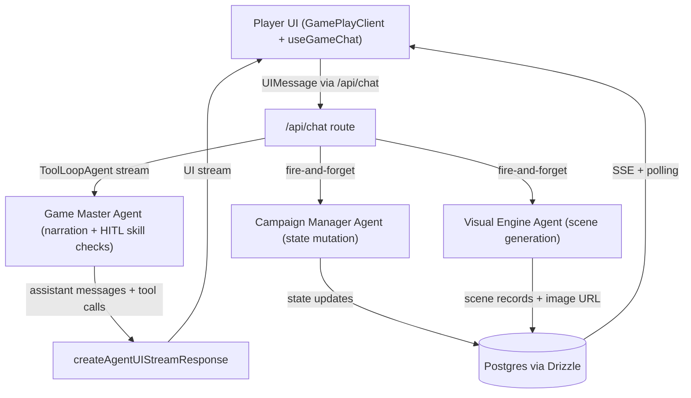
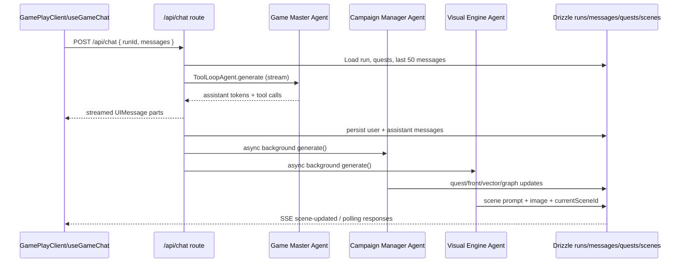

# Agents Architecture

> **Note**: This document provides implementation-oriented details about the current agent architecture. For canonical patterns, data contracts, and best practices, see **[docs/AGENTIC-ARCHITECTURE.md](docs/AGENTIC-ARCHITECTURE.md)**.

This document explains how the current AI agent architecture coordinates narration, state reconciliation, and scene generation across the system. It references the following implementation anchors:

- Game Master Agent: `src/agents/game-master.ts`
- Campaign Manager Agent: `src/agents/campaign-manager.ts`
- Visual Engine Agent: `src/agents/visual-engine.ts`
- Chat orchestration: `src/app/api/chat/route.ts`
- Legacy server action: `src/app/actions/game.ts`
- Client runtime: `src/app/runs/[id]/play/game-play-client.tsx`
- Client state: `src/lib/store/game-store.ts`

## Architectural Overview

The architecture cleanly separates user-facing narration (Game Master Agent) from background state mutation (Campaign Manager Agent) and visual synthesis (Visual Engine Agent). The chat API route streams GMA output to the UI and asynchronously fans out to CMA and VEA for reconciliation and imagery. State is persisted in Drizzle tables (`runs`, `messages`, `quests`, `scenes`) while the client keeps lightweight UI state in Zustand and polls for server-side changes.

### System Topology

## Agents and Responsibilities

### Game Master Agent (GMA)

- Location: `src/agents/game-master.ts`
- Model: OpenRouter `base` via `ToolLoopAgent`.
- Tools: Only `requestSkillCheck` (HITL) for dice rolls; **no state-mutating tools**.
- Duties: Interactive narration, pacing, and issuing skill checks. Reads campaign/quest context but treats it as read-only.
- Limits: `stopWhen: stepCountIs(5)` to avoid tool spam.

### Campaign Manager Agent (CMA)

- Location: `src/agents/campaign-manager.ts`
- Model: OpenRouter `reasoning` via `ToolLoopAgent`.
- Tools: All state-mutating tools (`updateNarrativeVector`, `manageRelationship`, `advanceFront`, `createQuest`, `updateQuest`); **excludes** `requestSkillCheck`.
- Duties: Sole owner of campaign state reconciliation—quest updates, fronts, narrative vectors, relationships, and contextual logs. Runs in the background with deterministic, non-user-facing execution.
- Limits: `stopWhen: stepCountIs(3)` for bounded background passes.
- State safety: Captures an immutable `originalStateCopy` and exposes `hasStateChanged` for persistence decisions.

### Visual Engine Agent (VEA)

- Location: `src/agents/visual-engine.ts`
- Model: OpenRouter `base` via `ToolLoopAgent`.
- Tools: `shouldGenerateScene`, `generateImagePrompt`, `generateSceneImage` (Replicate-backed).
- Duties: Background detection of narrative change, prompt crafting, and scene image generation. Writes scenes and updates run’s current scene reference.
- Limits: `stopWhen: stepCountIs(3)`; only runs when `hasNarrativeText` is true to avoid tool-call-only chatter.
- Action focus: Uses the latest user action (`extractCharacterAction`) to steer prompt content.

## Request Lifecycle (`/api/chat`)

1. **Auth & ownership**: Clerk auth + user profile check; fetch run + character + campaign + universe; enforce run ownership.
2. **Message intake**: Validate incoming `UIMessage[]`; load the last 50 stored messages; filter out empty parts (`prepareMessagesForModel`).
3. **Context assembly**: Build `campaignState` from separate run columns and fetch active quests for read-only narrative context.
4. **Streamed narration**: Instantiate GMA and stream via `createAgentUIStreamResponse`. UI receives token-by-token narration and tool calls.
5. **Persistence on finish**:
   - Save last meaningful user message.
   - Save the final assistant message (including tool parts).
   - Persist assistant messages containing HITL tool outputs encountered in the incoming payload.
6. **Background fan-out** (fire-and-forget):
   - Invoke CMA with the last ~20 text-bearing messages to reconcile state. If `hasStateChanged`, persist `relationships`, `activeFronts`, `narrativeVectors`, and `currentContext` to `runs`.
   - Invoke VEA with the last ~10 messages plus current scene; generate and store a new scene only when warranted.

### Message Flow

## Client Runtime (`game-play-client.tsx`)

- Uses `useGameChat` to stream narration and tool calls. Sends a synthetic `" "` message to trigger the opening scene when a run has no messages.
- Subscribes to `/api/runs/[id]/scene-events` SSE for scene updates; falls back to `getCurrentSceneAction` if needed.
- Polls `getRunStateAction` every 5 seconds to detect state changes (fronts, vectors, relationships) and surfaces toast notifications via `detectStateChanges`/`notifyStateChanges`.
- Manages UI state via `useGameStore` (current run/character, pending skill checks, active scene, rolling flags).

## State and Data Persistence

- Messages: Stored as `UIMessage.parts` JSON in `messages` table; both narration and tool-call/result parts are preserved.
- Run state: `runs` columns hold `relationships`, `activeFronts`, `narrativeVectors`, `currentContext`; only CMA writes these.
- Quests: Managed through quest tools (CMA), persisted directly in quest tables.
- Scenes: VEA writes scene records and image URLs; `currentSceneId` on `runs` tracks the active scene reference.

## HITL Skill Check Flow

1. GMA emits `requestSkillCheck` tool part with `state: "input-available"`.
2. Client renders the skill check UI (dice) and, on completion, calls `addToolOutput` with `output` + `toolCallId`.
3. The next `/api/chat` call contains the assistant message with `state: "output-available"`; the server persists it using **update-by-toolCallId** pattern:
   - Find existing assistant message containing the matching `toolCallId` in stored `parts`
   - Update that message's `content` (JSONB) with the full `parts` array including `output`
   - Insert only if no matching message exists
   - This ensures skill check results persist correctly after page reload

**See [docs/AGENTIC-ARCHITECTURE.md](docs/AGENTIC-ARCHITECTURE.md) for the canonical HITL persistence pattern and migration details.**

## Operational Notes

- GMA never mutates state; CMA is the single writer for campaign state.
- Background agents are non-blocking; chat latency stays tied to GMA only.
- Scene generation is gated by narrative-text detection to avoid tool-call noise.
- Legacy `continueGame` in `src/app/actions/game.ts` exists but is superseded by `/api/chat`; it lacks tools and is maintained for backward compatibility.
