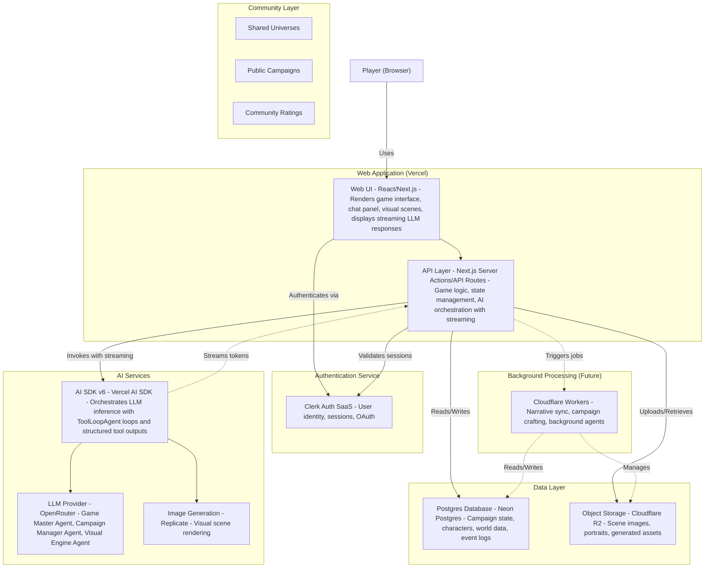

# RPGen — Architecture Overview

## 1. Project Summary

This project is a Next.js-based web app that runs a procedurally generated, AI-driven RPG campaign inspired by text-based dungeons, DnD mechanics, and classic point-and-click adventures. The game merges:

- Dynamic world & campaign generation
- Player-driven actions interpreted by an AI “Game Master Agent”
- Visual scene generation for each step of the story
- Long-running background interactions to maintain narrative coherence (future feature)

## 2. High-Level Architecture (C4-Style Container Diagram)



## 3. Technology Stack

**Frontend**

- Next.js (Vercel) — React-based framework for UI, routing, server actions, and ISR.
- TypeScript — typed, safer frontend + backend logic.
- AI SDK v6 (Vercel) — unified interface for chat UI + LLM inference with **streaming responses**, **ToolLoopAgent** tool-calling loops (`stopWhen`, `prepareStep`), and **object generation** (`generateObject`).

**Authentication**

- Clerk
- Handles user identity, sessions, OAuth, email/password auth.
- Provides server helpers to secure API routes and server actions.

**Database & Validation Strategy**

- Neon Postgres
- Serverless Postgres with autoscaling + branching.
- Stores:
  - User profiles
  - Universe data (Private & Public)
  - Campaign state (Private & Public)
  - Character sheets
  - Event logs
- **Dual-Purpose Zod Schemas**:
  - All complex data structures (Universe Ontology, Campaign State, Character Bio) are defined as Zod schemas.
  - These schemas serve two simultaneous roles:
    1. **Database Validation**: Ensuring data integrity before JSONB insertion.
    2. **AI Generation**: Passing strict structure requirements to the LLM via `generateObject` and `tool` definitions.

**Object Storage**

- Cloudflare R2
- Stores generated images:
  - Scenes
  - Character portraits
  - Environment panels
- Cheap, reliable object storage with near-zero egress.

**AI Layer**

- AI SDK v6 — orchestration of inference flows with **streaming responses** to immediately display LLM output to players as tokens are generated, plus ToolLoopAgent for iterative tool calls.
- OpenRouter — LLM provider routing for:
  - Game Master Agent (interactive, HITL skill checks, narration only)
  - Campaign Manager Agent (background state reconciliation, sole state writer)
  - Visual Engine Agent (background scene generation decisions)
  - Campaign Crafter Agent (future)
  - Scribe Agent (future)

**See [docs/AGENTIC-ARCHITECTURE.md](docs/AGENTIC-ARCHITECTURE.md) for detailed agent responsibilities and execution patterns.**
- Replicate — image/multimedia models for visual rendering:
  - Flux Schnell model for fast scene generation
  - Handles async responses with proper URL extraction from response objects
  - Supports webhook-based async processing (optional, for truly non-blocking workflows)

---

## 4. Application Architecture

### 4.1 Game Loop

1. Player reads the current story segment.
2. Player submits an action via chat.
3. Next.js API (`/api/chat`) receives the request and:
   - Validates authentication and run ownership
   - Loads last 50 messages and active quests for context
   - Instantiates Game Master Agent (GMA) for interactive narration
4. **Game Master Agent (GMA)** streams narration via `createAgentUIStreamResponse`:
   - Generates immersive, descriptive storytelling
   - Issues HITL skill checks (`requestSkillCheck` tool) when player actions require dice rolls
   - **GMA does NOT modify campaign state** (read-only access to quests and state for narrative context)
   - **LLM responses are streamed** (via AI SDK) to the UI, allowing players to see the story appear in real-time as tokens are generated.
5. On GMA completion (`onFinish` callback):
   - Persist user and assistant messages to database
   - **Campaign Manager Agent (CMA)** runs in background (fire-and-forget):
     - Analyzes recent transcript for state changes
     - Updates quests, fronts, narrative vectors, and relationships deterministically
     - Persists state changes only if `hasStateChanged()` returns true
   - **Visual Engine Agent (VEA)** runs in background (fire-and-forget):
     - Analyzes narrative changes to determine if scene regeneration is needed
     - Generates scene images via Replicate API when significant location/environment changes occur
     - Stores images in R2 with key format: `{userId}/runs/{runId}/scenes/{sceneId}.webp`
     - Updates run's `currentSceneId` reference
6. Next.js renders updated UI with current scene image (converted from R2 key to public/signed URL).

**See [docs/AGENTIC-ARCHITECTURE.md](docs/AGENTIC-ARCHITECTURE.md) for detailed agent patterns and execution models.**

### 4.2 World & Campaign Generation

- On new campaign start, the backend sends a structured prompt to OpenRouter-LLM using AI SDK.
- Stores:
  - Universe
  - Factions
  - History
  - Key events
- Defined in the spec (see feature documentation).

### 4.3 Character Creation

- Rolling stats (Strength, Agility, Intelligence, etc.).
- Created via:
  - TypeScript logic
  - Clerk identity
  - Neon persistence
- LLM generates backstory and fills missing details.

### 4.4 Visual Rendering Engine

- **Visual Engine Agent (VEA)**: Background agent that monitors narrative changes and automatically generates scene images
  - Uses AI SDK v6 `ToolLoopAgent` with limited tool cycles (3 max) for efficiency
  - Analyzes recent messages to determine if scene regeneration is needed
  - Crafts detailed image prompts with character/universe context
  - Generates images via Replicate API (flux-schnell model)
  - Stores images in R2 with structured key format: `gen-dnd/{userId}/runs/{runId}/scenes/{sceneId}.webp`
  - Updates run's `currentSceneId` to track the latest scene
  - Runs non-blocking (fire-and-forget) to avoid blocking chat responses
- **Scene Storage**: 
  - R2 stores versioned scenes with metadata (generation prompt, narrative context, previous scene ID)
  - Database stores R2 key (not full URL) for flexibility
  - URLs are generated on-demand using `getPublicUrl()` (supports public domains or signed URLs)
- **Scene Display**:
  - Play page fetches current scene and converts R2 key to URL
  - SceneVisualizer component displays scene with zoom functionality
  - Images are served via public domain or signed URLs (1-hour expiration)

## 5. Background Job System (High-Level)

(No queues implemented yet—future-proof description only.)

Background agents:

- **Campaign Crafter Agent**
  - Monitors player progression
  - Adjusts faction goals, alliances, world parameters
- **Scribe Agent**
  - Compiles narrative logs
  - Produces an "campaign tale", with a recolection of the key events of the adventure.

Execution Environment:

- Cloudflare Workers
  - Future use for:
    - Scheduled CRON tasks
    - Lightweight ETL (e.g., pruning old logs, recomputing summaries)
    - Triggered narrative updates
    - Image pruning / object lifecycle policies
    - Non-blocking long-running tasks outside Next.js runtime

Infrastructure-as-Code:

- Wrangler (Cloudflare IaC) to define:
  - Workers
  - R2 buckets
  - CRON triggers (future)

---

## 6. Repository Structure

```
├─ src/
│ ├─ app/ # Next.js App Router
│ │ ├─ (routes)/ # Route groups
│ │ ├─ api/ # API routes & Server Actions
│ │ ├─ layout.tsx
│ │ └─ page.tsx
│ ├─ components/ # React components
│ ├─ hooks/ # Custom React hooks
│ ├─ lib/
│ │ ├─ ai/ # AI SDK wrappers
│ │ ├─ auth/ # Clerk helpers
│ │ ├─ db/ # Neon client
│ │ ├─ storage/ # R2 upload handlers
│ │ └─ game/ # Dice rolling, state machines
│ ├─ types/ # TypeScript types (Campaign, World, Character)
│ ├─ agents/ # Game Master, Crafter, Scribe abstraction
│ └─ utils/ # Shared utilities
│
├─ public/ # Static assets
│
├─ workers/ # Cloudflare Workers (future)
│ ├─ sync-campaign/
│ │ ├─ index.ts
│ │ └─ wrangler.toml
│ └─ scribe/
│   ├─ index.ts
│   └─ wrangler.toml
│
├─ docs/
│ ├─ ARCHITECTURE.md
│ └─ SYSTEM_DESIGN.md
│
├─ next.config.js # Next.js configuration
├─ package.json
├─ tsconfig.json
└─ .env.local # Environment variables
```

## 7. Summary

This architecture gives you:

- Scalable hosting via Vercel
- Reliable, serverless database via Neon
- Modern authentication via Clerk
- Cheap object storage via Cloudflare R2
- AI-powered game logic via AI SDK + OpenRouter + Replicate
- Future expansion path via Cloudflare Workers for background jobs

Everything is modular, multi-project friendly, and cheap to run for early prototypes.
